# LAB-32-PPTP
tanggal 20 agustus 2025
# Point to Point Tunnel Protocol  
  PPTP di Mikrotik dapat dikonfigurasi menjadi PPTP server dan PPTP client atau langsung bersamaan keduanya. Untuk melihat service PPTP ini aktif atau tidak, kita bisa cek di **system > package > PPP**.  

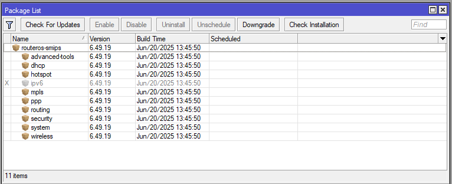  
  
  PPTP adalah protokol jaringan yang memungkinkan kita untuk mengirimkan paket data atau membuat sebuah koneksi melalui internet yang bersifat secure. Fungsi PPTP, misalnya kita ingin menghubungkan antara kantor A dan B dan kita ingin menghubungkan kedua kantor tersebut melalui jaringan internat, maka cara yang paling mudah dan bsia dikatakan aman adalah mengunakan PPTP.  

# Konfigurasi PPTP Server1 
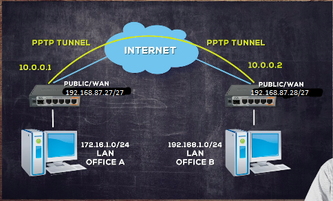  
  
1. Kita masuk ke **PPP > Interface > PPTP Server**, lalu pastikan **Enable** nya di checklist dan default profilenya **default-encryption**.  

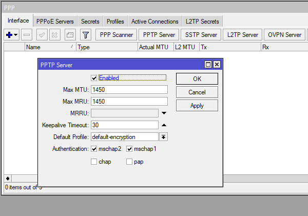  

2. Selanjutnya kita akan membuat akun untuk login, pergi ke **PPP > secret > add**. Isi name, password untuk login client. Untuk service PPTP ini ada 2 pilihan, yaitu **any** dan **pptp**, kita akan memilih yang lebih spesifik yaitu **pptp**. Profile kita pilih yang **default encryiption**, Local address itu merupakan alokasi IP Address yang akan didapat oleh PPTP server dan Remote address merupakan alokasi IP yang diberikan ke PPTP client. Untuk addressnya kita isi sesuai topologi.  

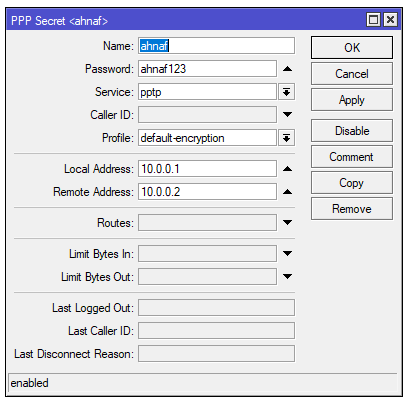  

3. Sampai disini, proses pembuatan PPTP server pada Office A sudah selesai.  

# konfigurasi PPTP client 
1. masuk ke mikrotik clinet  

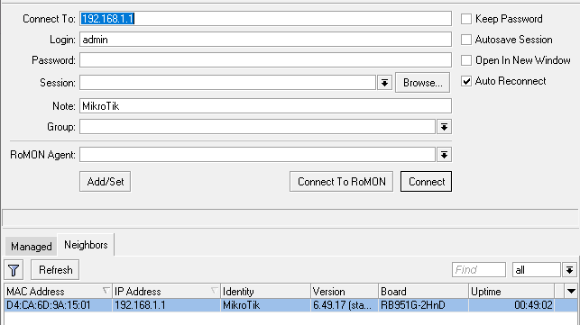

2. pilih menu  PPP > INTERFACE    
3. klik (+)     
4. pilih tab **dial out** isi parameter:   
   connect to: isikan ip public dari office A   
   masukkan user dan password PPTP sever   
   arahkan profile nya ke **default-encryption**    

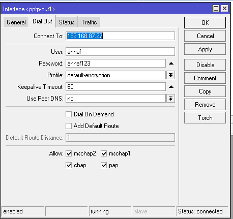

5. nah secara otomatis kita akan di buatkan interface baru oleh sistem namanya **pptp-out1**.   
dan flag nya R berarti sudah running/terkoneksi.   

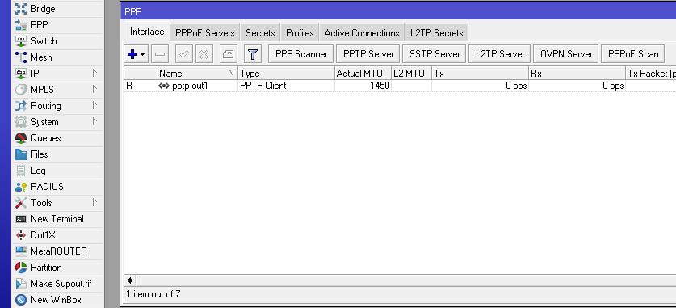

6. kita bisa lihat di address ip > address    
   klo sudah di tambambahkan nya ip sercara otomatis dari interface **pptp-out1.**   

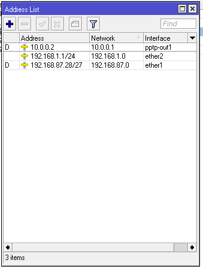

7. jika sudah terkoneksi sekarang kita buat pengaturan routing supaya pengaturan antar LAN yang ada pada office A dan office B bisa saling terkoneksi melalui PPTP tunnel.
   pilih menu ip > routes    
   di bagian dst.address isi dengan ip office A   
   gateway nya interface pptp-out1   

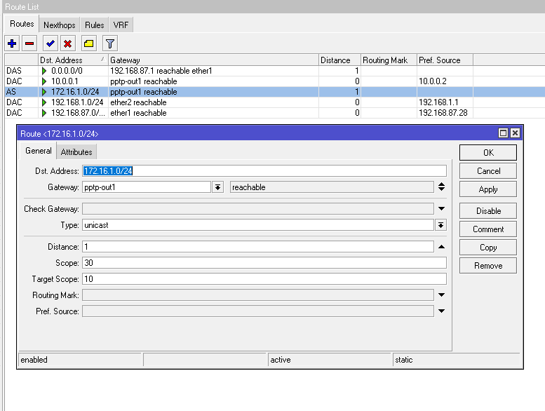

9. coba ping ke office A lewat terminal   

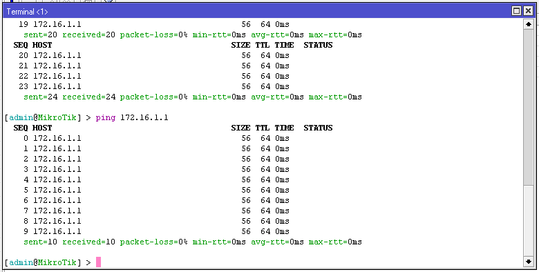

# Konfigurasi PPTP Server2
1. Jika client sudah selesai, kita bisa lihat di server bagian **active connecions** ada user yang sedang aktif.  

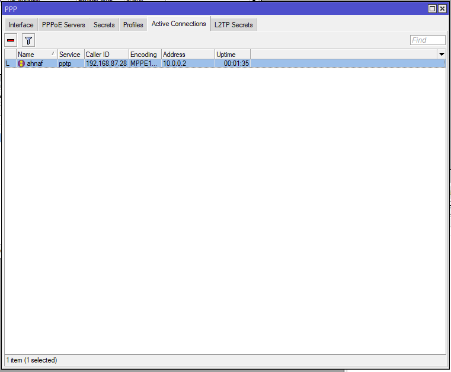  

2. Kita juga bisa lihat di tab **PPP > Interface** ada interface baru yang terbuat secara otomatis.  

  

3. Di bagian **IP > Addresses** juga ada IP baru dengan interface pptp   

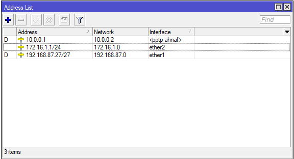  

4. Sekarang kita tambahkan static route baru, di **IP > routes**, Dst Addressnya kita isi dengan IP address yang ada pada jaringan Office B **192.168.1.0/24**, gateway nya **10.0.0.2** atau bisa juga dengan memilih interface.  

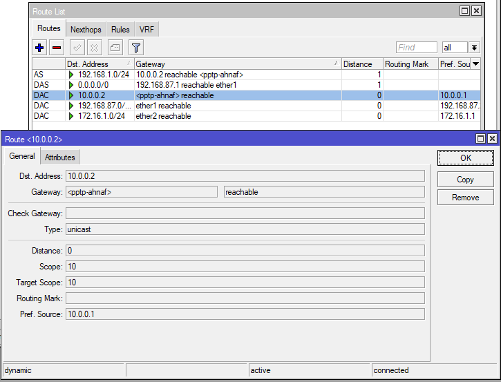  

5. Jika sudah coba tes koneksi dengan ping ke masing-masing, dari Server ke Client dan sebaliknya.  

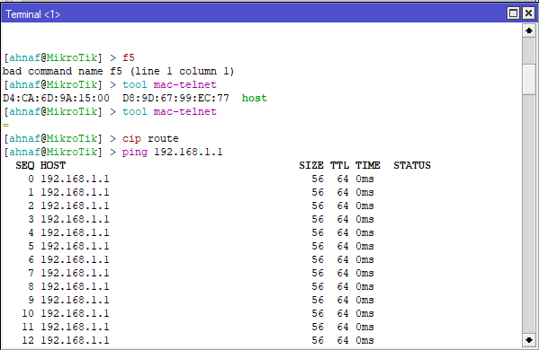  

# Kesimpulan  
  Mikrotik RouterOS bisa difungsikan baik sebagai server maupun client atau bahkan diaktifkan keduanya bersama dalam satu mesin yang sama. Feature ini sudah termasuk dalam package PPP sehingga anda perlu cek di menu system package apakah paket tersebut sudah ada di router atau belum.  
  
# Sumber
Youtube - Citraweb - https://www.youtube.com/watch?app=desktop&v=jyjTdpsUAIY&t=17m20s
 
